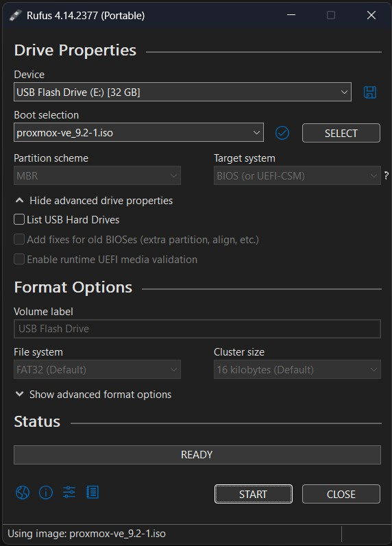

# Proxmox Virtual Environment

Proxmox VE provides the virtualization foundation for the homelab. This chapter walks you through installing Proxmox VE on your server, then configuring and securing its initial management interface before later chapters add LXC containers and services.

**Table of Contents**

- [Proxmox VE](#proxmox-virtual-environment)
  - [About Proxmox VE](#about-proxmox-ve)
  - [Install Proxmox VE](#install-proxmox-ve)
    - [Download Proxmox VE image and burn it on a USB flash drive](#download-proxmox-ve-image-and-burn-it-on-a-usb-flash-drive)
    - [Install Proxmox VE on a dedicated server](#install-proxmox-ve-on-a-dedicated-server)
  - [Setup Proxmox VE](#setup-proxmox-ve)
    - [Datacenter level settings](#datacenter-level-settings)
    - [Node level settings](#node-level-settings)
    - [Setup 2FA and recovery codes](#setup-2fa-and-recovery-codes)
    - [Basic Firewall settings](#basic-firewall-settings)
    - [Create Proxmox mobile user](#create-proxmox-mobile-user)
    - [Optional Proxmox VE Tools](#optional-proxmox-ve-tools)

## About Proxmox VE

[Proxmox Virtual Environment](https://www.proxmox.com/en/products/proxmox-virtual-environment/overview) (PVE) is an open-source server virtualization management platform. It is based on Debian GNU/Linux and manages KVM virtual machines alongside Linux Containers (LXC). It provides a web-based interface for managing virtual machines, LXC containers, storage, and networking. It also includes built-in firewall, backup, and clustering features. Proxmox VE is a popular choice for both homelabs and enterprise environments due to its ease of use, flexibility, and powerful features.

## Install Proxmox VE

This section prepares verified installation media, installs Proxmox VE on the physical server, and completes the node's first post-installation configuration.

### Download Proxmox VE image and burn it on a USB flash drive

- First, download the `ISO` image from the **[official Proxmox VE download page](https://www.proxmox.com/en/downloads/proxmox-virtual-environment/iso)**. Optionally, before writing it to the USB flash drive, calculate its SHA-256 checksum and compare it with the published **SHA256SUM**; a match confirms that the downloaded file is unchanged.
- Then download a bootable USB creation tool. This guide uses **[Rufus](https://rufus.ie)**.
- Open Rufus, select the USB flash drive and the Proxmox VE `ISO` image, and then click **START**.
  - After selecting the image, you might see the following expected message: *"The image you have selected is an ISOHybrid, but its creators have not made it compatible with ISO/File copy mode. As a result, DD image writing mode will be enforced."*
  - This message does not indicate a problem; continue with DD image writing mode.



### Install Proxmox VE on a dedicated server

This section provides a practical overview. For more detail and current platform requirements, see the **[official Proxmox VE installation documentation](https://pve.proxmox.com/wiki/Installation)**.

- Connect a monitor and keyboard to your server.
- Insert the USB flash drive, open the UEFI/BIOS boot menu, enable hardware virtualization if the firmware provides that setting, and boot from the USB flash drive.
  - Leave **Secure Boot** enabled when using current official installation media. Proxmox VE 8.1 and later support Secure Boot; disable it only as a temporary compatibility step after a verified boot or signature failure, or when using older installation media that predates that support.
  - **Fast Boot** is a separate firmware feature. Disable it only if the firmware skips the USB device or prevents you from opening the boot menu.
- Select **Install Proxmox VE (Graphical)**. If the graphical installer does not work correctly with the server's hardware, use **Install Proxmox VE (Terminal UI)** as the compatibility fallback.
- Complete each installer screen:
  - **EULA:** Read and accept the license agreement.
  - **Target Harddisk:** Select the disk on which Proxmox VE will be installed. The installer erases all existing data on the selected disk, so confirm its model and size and disconnect any disk that must not be overwritten.
    - **Options:** Use the default `ext4` filesystem for the installation and leave the other fields at their defaults. Advanced users may select another supported filesystem after reviewing its storage and hardware requirements.
  - **Location and Time Zone:** Select the correct country, time zone, and keyboard layout.
  - **Administration Password and Email Address:** Set a strong password for `root` and provide an email address that can receive administrative notifications.
  - **Management Network Configuration:**
    - **Management Interface:** Select the wired network interface. You can usually keep the default selection when only one wired interface is connected.
    - **Hostname:** Enter a fully qualified domain name in the format `<PROXMOX-HOSTNAME>.<DOMAIN>`, for example, `my-proxmox.home.arpa` or `my-proxmox.<MY-DOMAIN>.com`.
    - **IP Address:** Enter an unused static address with its CIDR prefix. The reference value is `192.168.0.11/24`; replace it if your network plan uses another subnet or address.
    - **Gateway:** Enter the router address for the management network, such as `192.168.0.1`.
    - **DNS Server:** During this initial installation, use the router or another DNS resolver already reachable on the network, such as `192.168.0.1`.
  - **Summary:** Recheck the target disk, network values, and other settings. Return to an earlier screen if anything is incorrect, and then click **Install**.
- After installation finishes, remove the USB flash drive and reboot the server. When the Proxmox VE console appears on the server's display, you can disconnect the monitor and keyboard.
- On your personal device, open `https://<IP-ADDRESS>:8006`. For the reference address, use `https://192.168.0.11:8006`.
  - The management interface should be reachable only from the trusted home network or an approved VPN configured later in this guide.
  - A browser warning is expected because a new Proxmox VE installation uses a self-signed certificate. Verify that the address is the one you configured, and then use the browser's advanced option to continue; in Firefox, this is **Accept the Risk and Continue**.
- Sign in to Proxmox VE:
  - **Username:** `root`
  - **Realm:** `Linux PAM standard authentication`
  - **Password:** The password you entered during installation

To complete the initial configuration, this guide uses the third-party [PVE Post Install script](https://community-scripts.org/scripts/post-pve-install) from the Proxmox VE Helper-Scripts community. It can adjust package repositories, optionally patch the subscription reminder, change HA service state, update Proxmox VE, and reboot the node. The script runs with unrestricted root access and its command follows the project's changing `main` branch, so review the current [`post-pve-install.sh` source](https://github.com/community-scripts/ProxmoxVE/blob/main/tools/pve/post-pve-install.sh) before every run.

In the Proxmox VE resource tree, select the node and open **Shell** (**Node → Shell**). Paste or type the following command there; do not run it in your personal device's terminal or in an LXC console.

```sh
bash -c "$(curl -fsSL https://raw.githubusercontent.com/community-scripts/ProxmoxVE/main/tools/pve/post-pve-install.sh)"
```

Read each prompt and choose it for your environment instead of accepting every option automatically:

- With a paid subscription, keep the enterprise repository. For this guide's no-subscription homelab, disable the enterprise repository and enable `pve-no-subscription`, which is the public but less-tested update channel.
- Do not enable `pve-test` or a Ceph repository for this single-node reference setup. Those repositories are for deliberate testing or a separately planned Ceph deployment.
- Removing the subscription reminder is optional and patches installed web-interface files.
- Keep the HA and Corosync services at their Proxmox VE defaults in this chapter. HA remains unconfigured on a single node; change service state only as part of a later, deliberate cluster design.
- Allow the script to install current updates only after reviewing its summary. A package upgrade or the final prompt can reboot the node, so save any work and confirm that no task is running before continuing.

After the node reboots, sign in again and open **`<NODE>` → Updates → Repositories**. Confirm that the repository for your subscription status is enabled, enterprise-only repositories are disabled, and `pve-test` remains disabled. Then open **`<NODE>` → Updates**, click **Refresh**, and confirm that the refresh completes without repository errors.

## Setup Proxmox VE

This section reviews the necessary datacenter- and node-level settings and introduces the menu entries most useful during initial setup. The **datacenter level** represents the whole Proxmox VE environment and can apply settings across its nodes. The **node level** represents one physical Proxmox host and its hardware, networking, storage, and host-specific options. Selecting an **LXC container or virtual machine** opens settings for only that guest.

### Datacenter level settings

- **Summary:** Confirm that each node is online and that the displayed CPU, memory, storage, and uptime values look correct.
- **Notes:** Optionally add a short description of the homelab, important IP addresses, or maintenance information. Notes support Markdown.
- **Cluster:** A Proxmox cluster joins multiple nodes for centralized management and provides a foundation for multi-node capabilities, but clustering alone does not provide high availability. The reference setup starts with one node, so a cluster is unnecessary here and would add quorum and operational requirements. If you have a multi-node cluster, you can follow [Create and join a Proxmox cluster](../TODO.md).
- **Ceph:** Ceph combines storage across multiple servers. It is not required for this single-node setup and should be deployed only as part of a separately designed multi-node storage plan.
- **Options:** Verify the keyboard layout. Keep the remaining options at their defaults unless a later section tells you to change them.
- **Storage:** Confirm that the default `local` and `local-lvm` storage entries are enabled and available.
  - `local` stores ISO images, LXC templates, and local backup files.
  - `local-lvm` stores virtual machine disks and LXC container filesystems.
- **Backup:** Backup jobs are configured at the datacenter level. Complete this after setting up Proxmox Backup Server later in this guide.
- **Permissions:** Keep using `root@pam` for the initial setup. The following sections will add two-factor authentication and a limited user for the Proxmox mobile app.
- **HA:** High availability allows a properly configured multi-node cluster to recover protected workloads on another available node after a host failure, reducing rather than eliminating downtime. It requires reliable quorum and storage or replicated data that another node can access. Leave HA unconfigured for this single-node setup and defer its design to the Advanced high-availability guides.
- **SDN:** Software-defined networking is not required for this setup. The guide uses the default `vmbr0` Linux bridge.
- **Firewall:** Complete the **Basic Firewall settings** section below before enabling the firewall.
- **Notifications:** Configure notification targets after setting up the notification server later in this guide.
- Other options are not required at this stage or are intended for advanced users.

### Node level settings

- **Summary:** Confirm that the node is online and that the displayed CPU, memory, storage, and uptime values look correct.
- **Notes:** Optionally add the node's purpose, hardware details, management IP address, or maintenance information. Notes support Markdown.
- **Shell:** This opens a root shell on the Proxmox host. No configuration is required here; use it only when a guide provides a command that must run on the node.
- **System → Network:** Verify that:
  - `vmbr0` contains the static management IP address configured during installation.
  - The correct physical network interface is listed as the bridge port.
  - The gateway matches your router's IP address.
  - Do not apply network changes unless you have confirmed the values, because an incorrect configuration can disconnect the node from the network.
- **System → Certificates:** The automatically generated Proxmox VE certificate is sufficient for the initial setup. A browser warning is expected while using this self-signed certificate. Do not replace or remove it at this stage.
- **System → DNS:** Verify that **Search domain** is `home.arpa` and **DNS server 1** is `192.168.0.1` for the reference network. Use the domain and resolver from your network plan if they differ.
- **System → Hosts:** Confirm that the node's hostname and management IP address are listed correctly, and leave the remaining entries unchanged. Do not edit these entries during initial setup unless you understand their purpose and have a recovery path; an incorrect hostname or address mapping can break name resolution and node management.
- **System → Options:** Keep the node options at their defaults unless a later section tells you to change them.
- **System → Time:** Confirm that the time zone is correct and the system clock is synchronized. Accurate time is required for two-factor authentication and cluster communication.
- **System → System Log:** Briefly check the recent log entries for recurring critical errors related to storage, networking, or time synchronization. Occasional informational messages and warnings do not necessarily indicate a problem.
- **Updates → Repositories:** Verify the repository configuration:
  - If you have a Proxmox subscription, keep the enterprise repository enabled.
  - If you do not have a subscription, keep the enterprise repository disabled and the `pve-no-subscription` repository enabled.
  - Keep the `pve-test` repository disabled unless you are intentionally testing new packages.
- **Updates:** Click **Refresh**, and then install any available updates by clicking **Upgrade**. Review the package list first and reboot the node if Proxmox VE indicates that a reboot is required.
- **Firewall:** Complete the **Basic Firewall settings** section below before enabling the node firewall. Use **Firewall → Log** later to review blocked or allowed traffic when troubleshooting firewall rules.
- **Disks:** Select each physical disk and review its S.M.A.R.T. information. Investigate any failed health check or warning before storing important data on the disk.
  - **LVM:** Displays regular LVM volume groups. Keep the installer-created `pve` volume group unchanged.
  - **LVM-Thin:** Displays thin-provisioned storage used for virtual machine and LXC container disks. Confirm that the installer-created `pve/data` thin pool is active and has the expected capacity.
  - **Directory:** Displays filesystems created and mounted through the node's disk management interface. No additional directory is required for the default setup.
  - **ZFS:** If Proxmox VE was installed on ZFS, confirm that the expected pool is online. Skip this option if the node does not use ZFS.
- **Task History:** Review recent tasks and confirm that setup actions and updates completed with an **OK** status. Open the task log to investigate any failed task.
- **Subscription:** If you have a paid subscription, upload its key and confirm that it is active. If you do not have one, no action is required after configuring the `pve-no-subscription` repository.
- Other options are not required at this stage or are intended for advanced users.

### Setup 2FA and recovery codes

This section enables time-based one-time password (TOTP) authentication for `root@pam`. Keep the current authenticated session open until a separate login and the recovery path have both been tested.

- Install a TOTP authenticator (Google Authenticator, BitWarden) on a separate trusted device.
- Go to **Datacenter → Permissions → Two Factor**, click **Add → TOTP**, and select `root@pam`.
- Generate the **Secret** and scan the displayed QR code with the authenticator. Add a short description so you can identify the factor later.
- Enter the current code from the authenticator in **Verification Code**, and then click **Apply**.
- In the same **Two Factor** panel, click **Add → Recovery Keys** for `root@pam`.
- Save the generated recovery keys outside the Proxmox VE node in a password manager or protected offline copy. Proxmox VE permits one recovery-key set per user, and each key can be used only once.
- Open a private browser window and sign in with the password and a current TOTP code.
- If the test fails, return to the still-open original session and correct or remove the new factor. If the authenticator is lost later, use an unused recovery key.

### Basic Firewall settings

The Proxmox VE firewall is disabled by default. This reference configuration applies a default-deny input policy to the host while allowing management only from the trusted LAN; add an approved VPN address or subnet later only after that VPN has been configured and tested. Do not add an Internet-wide source range.

- Before enabling the firewall, keep the current browser session open and, if you use SSH, open and retain a working SSH session. Make sure local monitor-and-keyboard access to the node is available as the final recovery path.
- Go to **Datacenter → Firewall → IPSet**, and then click **Create**.
  - **Name:** `management`
  - **Comment:** `Trusted management network`
- Select the `management` IP set, click **Add**, and enter the network that contains your management devices.
  - **CIDR:** `192.168.0.0/24`
  - Replace this reference value if your trusted LAN uses another subnet. If you manage the node over IPv6, add the specific trusted IPv6 source as well; an IPv4 entry does not authorize an IPv6 client.
- Confirm that the address of the computer you are currently using is included in `management`.
- Go to **Datacenter → Firewall → Options** and configure:
  - **Firewall:** `Yes`
  - **Input Policy:** `DROP`
  - **Output Policy:** `ACCEPT`
  - **Forward Policy:** `ACCEPT`
- Select the Proxmox VE node, go to **Firewall → Options**, and set **Firewall** to `Yes`.
- Keep the original sessions open. In a second browser window, open `https://<IP-ADDRESS>:8006` and confirm that you can sign in. If you use SSH, open a second SSH connection and confirm that it succeeds.
- If either test fails while the original session still works, immediately set the node's **Firewall** option to `No`, then set the datacenter **Firewall** option to `No`, correct the `management` entry, and test again before re-enabling either level.

The standard `management` IP set applies to host firewalls and permits its members to use the Proxmox VE web interface on TCP port `8006`, SSH on TCP port `22`, the VNC web console on TCP ports `5900–5999`, and the SPICE proxy on TCP port `3128`; it also permits TCP ports `60000–60050` for migrations used by clusters. Proxmox VE filters both IPv4 and IPv6, and its Neighbor Discovery Protocol option is enabled by default so IPv6 neighbor discovery continues to work. Firewall enablement for individual virtual machines and LXC containers remains separate from these host settings.

If a later firewall change locks you out, use [Recover from Authentication or Firewall Lockout](../TODO.md) to restore management access.

### Create Proxmox mobile user

The existing `root@pam` identity is the Proxmox host's system `root` account authenticated through the Linux PAM realm. It has unrestricted administrative access, so the guide uses it during initial setup, when every required setting must be available. Protect it with a strong password, tested 2FA, and securely stored recovery keys; it is not the best account for routine sign-ins from a mobile device.

A dedicated mobile user follows the principle of least privilege. It receives only the visibility, node and guest power-management, guest backup, and selected backup-storage permissions needed for the mobile workflow. This reduces the impact of a lost phone or compromised credential without replacing `root@pam` for administration or recovery.

Now, let's create this dedicated user for the Proxmox mobile app and grant it only the permissions it needs.

- **Create group:** Go to **Datacenter → Permissions → Groups → Create**.
  - **Group name:** `mobile-users`
  - **Comment:** `Limited-access group for Proxmox mobile app users`
- **Create user:** Go to **Datacenter → Permissions → Users → Add**.
  - **User name:** `mobile`
  - **Realm:** `Proxmox VE authentication server`
  - **Password:** generate a strong, unique value and store it in a password manager.
  - **Group:** `mobile-users`
  - **Comment:** `Mobile app user (audit + power + backup)`
  - These values create the user ID `mobile@pve`.
- **Create custom roles:** Go to **Datacenter → Permissions → Roles → Create** and create each of the following roles.
  - **Datacenter audit**
    - **Role name:** `MobileDatacenterAudit`
    - **Privileges:** `Sys.Audit`
  - **Node power management**
    - **Role name:** `MobileNodePower`
    - **Privileges:** `Sys.Audit`, `Sys.PowerMgmt`
  - **Guest audit, power, and backup**
    - **Role name:** `MobileGuestAudit`
    - **Privileges:** `VM.Audit`, `VM.Backup`, `VM.PowerMgmt`
  - **Backup storage access**
    - **Role name:** `MobileBackupStore`
    - **Privileges:** `Datastore.AllocateSpace`, `Datastore.Audit`
- **Assign permissions (ACLs) to the group:** Go to **Datacenter → Permissions → Add → Group Permission** and add each entry below.
  - **Datacenter-level audit for the mobile interface**
    - **Path:** `/`
    - **Group:** `mobile-users`
    - **Role:** `MobileDatacenterAudit`
    - **Propagate:** `No`
  - **Node power permissions for all nodes**
    - **Path:** `/nodes`
    - **Group:** `mobile-users`
    - **Role:** `MobileNodePower`
    - **Propagate:** `Yes`
  - **Guest permissions for all virtual machines and LXC containers**
    - **Path:** `/vms`
    - **Group:** `mobile-users`
    - **Role:** `MobileGuestAudit`
    - **Propagate:** `Yes`
  - **Backup storage permissions**
    - Add this entry after the intended backup storage exists. Replace `<BACKUP-STORAGE>` with its Proxmox VE storage ID; the later reference setup uses `/storage/pbs`.
    - **Path:** `/storage/<BACKUP-STORAGE>`
    - **Group:** `mobile-users`
    - **Role:** `MobileBackupStore`
    - **Propagate:** `No`

Set **Propagate** to **Yes** only when the role should apply to all child objects under a path, such as `/nodes` for all nodes or `/vms` for all virtual machines and LXC containers.

In **Datacenter → Permissions → Two Factor**, optionally add a TOTP factor and recovery keys for `mobile@pve` by following the same workflow used for `root@pam` above.

Install the official [Proxmox VE mobile app](https://pve.proxmox.com/wiki/Proxmox_VE_Mobile) on Android, or use the mobile web interface, and sign in as `mobile@pve`. Confirm that the account can view the intended resources and perform only the documented power and backup actions. Continue to access Proxmox VE only from the trusted LAN or the approved VPN; a limited account does not make public exposure safe.

The same user, group, custom-role, and ACL workflow can create dedicated accounts for other purposes. Define the required task first and grant only its necessary privileges instead of reusing `root@pam` or copying the mobile roles unchanged.

### Optional Proxmox VE Tools

These third-party tools are not required for the reference setup, but they can add hardware visibility or maintenance convenience. Review each linked source and confirm compatibility with your installed Proxmox VE release before granting it host-level access.

- [Meliox PVE-mods](https://github.com/Meliox/PVE-mods) adds hardware sensor readings to the node interface.
- [PVE LXC Tag](https://community-scripts.org/scripts/add-iptag) maintains IP-address tags for virtual machines and LXC containers through a host service.
- [PVE LXC Updater](https://community-scripts.org/scripts/update-lxcs) updates operating-system packages inside supported LXC containers, but it does not update their installed applications.
